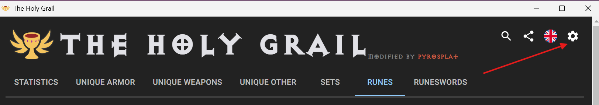
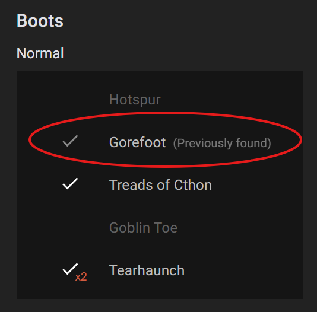
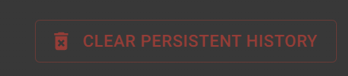

# Holy Grail (Diablo II: Resurrected)

Automatic tracker for the Diablo 2 Resurrected **Holy Grail** challenge (offline characters).  
Built with **Electron**, **React**, and **TypeScript**.

> **Modified by PyroSplat** – includes persistence, badges, sound notifications, and UI tweaks.

Also checkout https://github.com/pyrosplat/TheHolyGrail-Public-Tracker - Web app that will interface with this client for public grail tracking!


---
<!-- Hero / App Overview Screenshot -->
<p align="center">
  
</p>

## ✨ Features

- **Sundered charms** are included in the grail tracker.
- **Persistent found items** (optional):  
  Toggle in **Settings → "Persist found on drop"** to count items you've found historically—no need to keep them on mules or in stash.
- **"Previously found" badge** + subtle grey checkmark beside items that are counted due to history (not currently in stash).
- **"Only missing" filter** respects history when persistence is ON (hides items previously found).
- **Summary totals** reflect historically found items when persistence is ON.
- **Clear persistent history** (with confirmation dialog):  
  Wipes the "Previously found" history and updates totals/badges instantly.  
  > ⚠️ **Warning:** This is **permanent**. Your stash is not touched.
- **Sound notifications** for newly found items:
  - Customizable volume control
  - Support for custom sound files (WAV, MP3, OGG)
  - Test sound functionality
  - Built-in default notification sound
- **Theme & font tweaks** for a cleaner look.

For more info about the original project, see **[holygrail.link](https://holygrail.link)**.

---

## 🧰 How to enable persistence

1. Open **Settings** (gear icon in the top bar).  
   _Screenshot settings:_  
   

2. Toggle **Persist found on drop**.  
   _Screenshot: enable persistence toggle:_  
   

3. When enabled:
   - Items you've found before show a **"Previously found"** badge and a **grey check**.
   - These items **count toward your grail totals** and are **hidden by "Only missing"**.

   _Screenshot: badges in the list view:_  
   

4. To remove historical counts/badges:
   - Click **Clear persistent history…** in Settings and confirm.  
   

> Tip: Persistence is great if you mule/sell items but still want credit for prior drops.

---

## 🔊 Sound Notifications

Get audio alerts when you find new grail items!

1. Open **Settings** and scroll to **Sound Settings**.
2. Toggle **"Play sound when new item is found"**.
3. Configure your audio preferences:
   - **Volume control**: Adjust from 0% to 100%
   - **Custom sound file**: Use your own WAV, MP3, or OGG file
   - **Test sound**: Preview your current sound settings

   _Screenshot: sound control panel:_  
   

4. **Sound options**:
   - **Default**: Uses built-in notification sound
   - **Custom**: Upload your own sound file for personalized alerts
   - **Volume**: Fine-tune the notification volume independently

> **Tip**: Use a distinctive sound that won't get lost in game audio. Short, clear notification sounds work best!

**Supported formats**: WAV, MP3, OGG

---

## 🪟 Overlay: Live Grail Stats (On-Top / Stream-Ready)

Display your live Holy Grail progress right over the game window—perfect without alt-tabbing.

<p align="center">  </p>

**Features**
- Completion % and found / total (updates in real time)
- Compact, high-contrast design that stays readable over D2R
- It does not modify the game in any way.
- Adjustable size in settings

---

# Info for developers

## Installation

Use a package manager of your choice (npm, yarn, etc.) in order to install all dependencies

```bash
yarn
```

## Usage

Just run `start` script.

```bash
yarn start
```

## Packaging

To generate the project package based on the OS you're running on, just run:

```bash
yarn package
```

## Contributing

Pull requests are always welcome 😃.

## License

[ISC](https://choosealicense.com/licenses/isc/)

