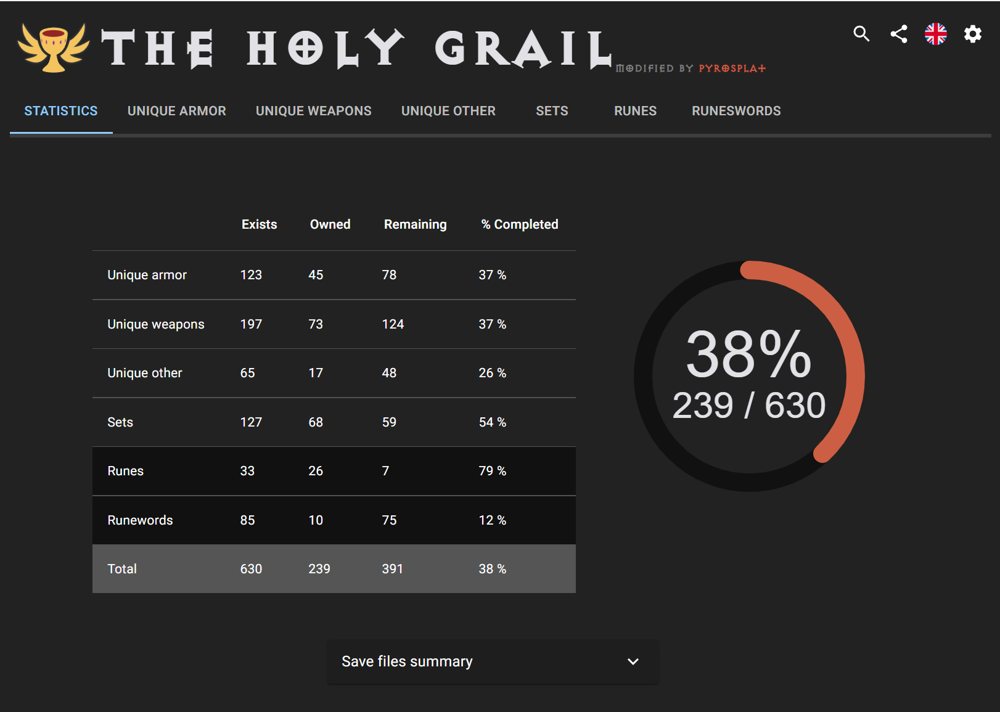
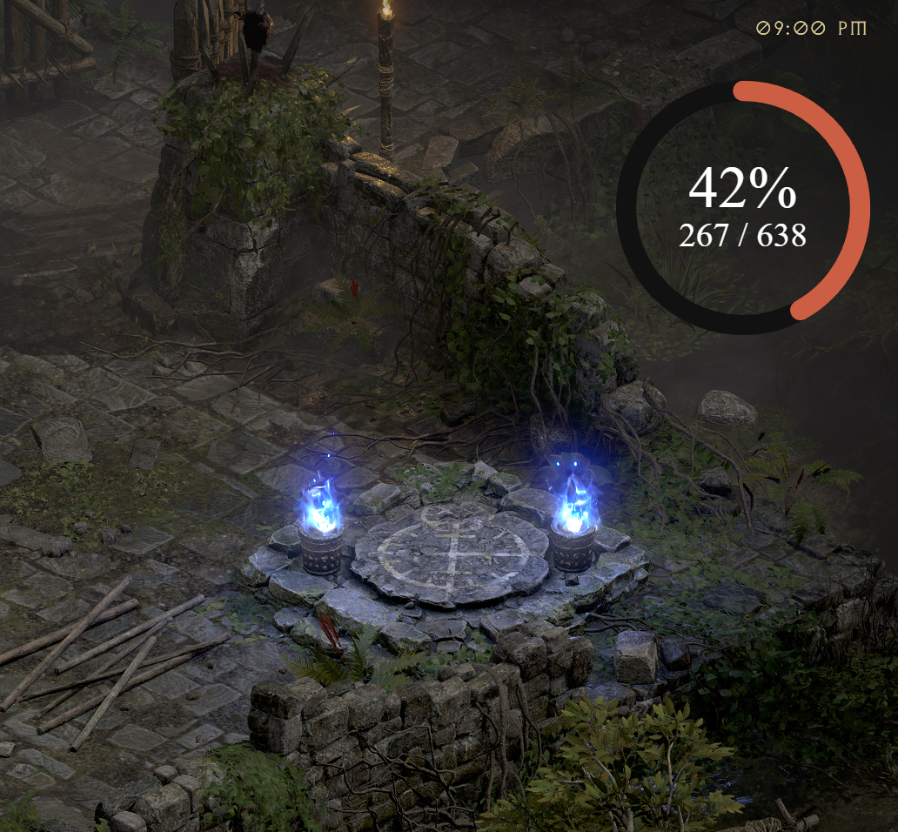

## Usage
```bash
yarn start # Also populates recent finds list for testing

yarn package
```

---
---
**Original README:**
# Holy Grail (Diablo II: Resurrected)

Automatic tracker for the Diablo 2 Resurrected **Holy Grail** challenge (offline characters).  
Built with **Electron**, **React**, and **TypeScript**.

> **Modified by PyroSplat** – includes persistence, badges, sound notifications, and UI tweaks.

Also checkout https://github.com/pyrosplat/TheHolyGrail-Public-Tracker - Web app that will interface with this client for public grail tracking!


---
<!-- Hero / App Overview Screenshot -->
<p align="center">
  
</p>

## ✨ Features

- **Sundered charms** are included in the grail tracker.
- **Persistent found items** (optional):  
  Toggle in **Settings → "Persist found on drop"** to count items you've found historically—no need to keep them on mules or in stash.
- **"Previously found" badge** + subtle grey checkmark beside items that are counted due to history (not currently in stash).
- **Clear persistent history** (with confirmation dialog):  
  Wipes the "Previously found" history and updates totals/badges instantly.  
  > ⚠️ **Warning:** This is **permanent**. Your stash is not touched.
- **Custom Sound notifications** for newly found items:
  - Customizable volume control
  - Support for custom sound files (WAV, MP3, OGG)
- **Theme & font tweaks** for a cleaner look.

## 🔊 Sound Notifications

Get audio alerts when you find new grail items!

   _Screenshot: sound control panel:_  
   

> **Tip**: Use a distinctive sound that won't get lost in game audio. Short, clear notification sounds work best!

---

## 🪟 Overlay: Live Grail Stats (On-Top / Stream-Ready)

Display your live Holy Grail progress right over the game window—perfect without alt-tabbing.

<p align="center">  </p>

**Features**
- Compact, high-contrast design that stays readable over D2R
- Adjustable size in settings
- Optional recent finds item list

---

# Info for developers

## Installation

Use a package manager of your choice (npm, yarn, etc.) in order to install all dependencies

```bash
yarn
```

## Usage

Just run `start` script.

```bash
yarn start
```

## Packaging

To generate the project package based on the OS you're running on, just run:

```bash
yarn package
```

## Contributing

Pull requests are always welcome 😃.

## License

[ISC](https://choosealicense.com/licenses/isc/)

